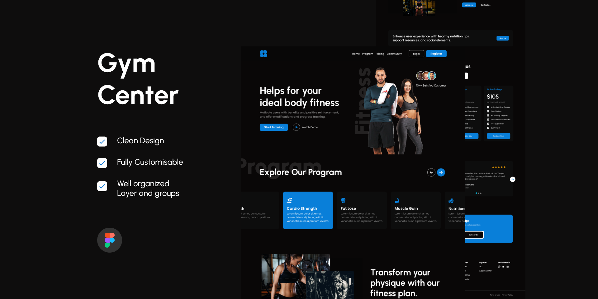

# Gym Center - Fitness Website

<p align="center">
    
</p>


## Visão Geral

Este é um projeto de uma página de academia que ajuda usuários a encontrar o plano de fitness ideal para suas necessidades. A interface oferece funcionalidades como visualização de programas, planos de preços e depoimentos de clientes satisfeitos. Construída com **React**, **Vite**, **TypeScript**, e **Chakra UI** para garantir uma experiência de usuário moderna e fluida.

## Features

- Programas de fitness exibidos em cards interativos.
- Depoimentos de usuários satisfeitos em um carrossel de slides.
- Alternância entre planos de preços mensais e anuais.
- Seção de inscrição para receber dicas de fitness.

## Pré-requisitos

Antes de iniciar, certifique-se de ter as seguintes ferramentas instaladas em seu sistema:

- **Node.js** (versão 14.x ou superior)
- **npm** ou **yarn**
- **Git**

## Tecnologias Utilizadas

- **React**: Biblioteca JavaScript para construção de interfaces de usuário.
- **Vite**: Ferramenta de desenvolvimento rápida para projetos frontend.
- **TypeScript**: Superconjunto de JavaScript que adiciona tipagem estática ao código.
- **Chakra UI**: Biblioteca de componentes UI simples e modular, com base em design system.
- **Swiper.js**: Biblioteca de carrossel de slides.

## Instalação

Siga estas etapas para rodar o projeto localmente:

1. Clone o repositório:
   ```bash
   git clone https://github.com/kayoronald/gym-center.git
   cd gym-center
   ```

2. Instale as dependências:
   ```bash
   # usando npm
   npm install

   # ou usando yarn
   yarn install
   ```

3. Rode o projeto:
   ```bash
   # usando npm
   npm run dev

   # ou usando yarn
   yarn dev
   ```

4. Abra o navegador e acesse:
   ```
   http://localhost:5173
   ```

## Estrutura de Pastas

Abaixo está a estrutura de pastas principal do projeto:

```
├── public/             # Arquivos públicos
├── src/                # Código fonte do projeto
│   ├── assets/         # Imagens e fontes
│   ├── components/     # Componentes reutilizáveis da UI
│   ├── pages/          # Páginas da aplicação
│   ├── styles/         # Estilos globais e configurações de tema do Chakra UI
│   ├── App.tsx         # Componente principal
│   └── main.tsx        # Arquivo de entrada
├── .gitignore          # Arquivos a serem ignorados pelo Git
├── index.html          # Documento HTML principal
├── package.json        # Dependências e scripts do projeto
└── tsconfig.json       # Configurações do TypeScript
```

## Contribuição

Se você deseja contribuir com este projeto:

1. Crie uma _branch_:
   ```bash
   git checkout -b minha-nova-feature
   ```

2. Faça as alterações desejadas e faça um _commit_:
   ```bash
   git commit -m "Adiciona nova feature"
   ```

3. Envie suas mudanças:
   ```bash
   git push origin minha-nova-feature
   ```

4. Abra um _pull request_.

## Licença

Este projeto está licenciado sob a licença **MIT**. Veja o arquivo [LICENSE](./LICENSE) para mais detalhes.
